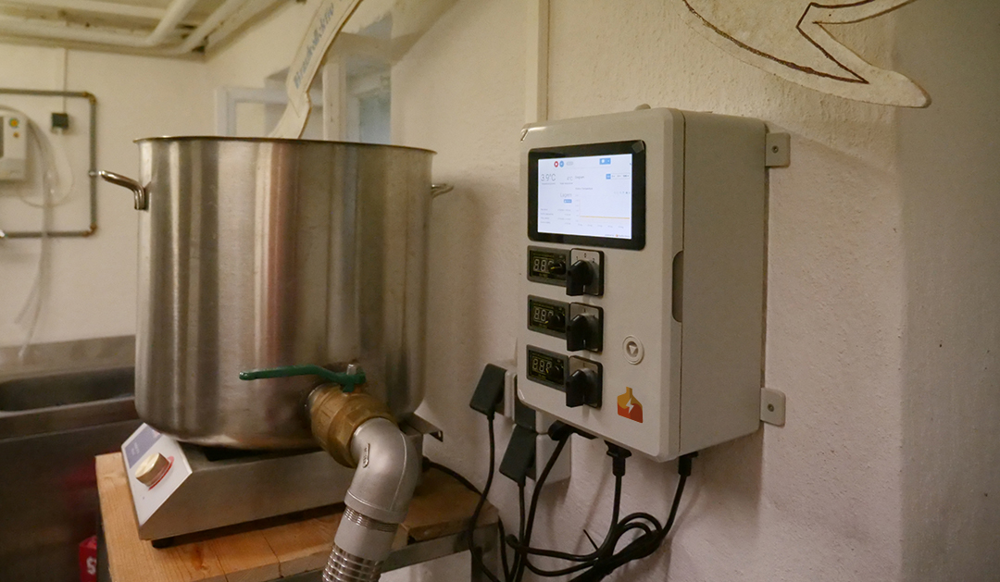
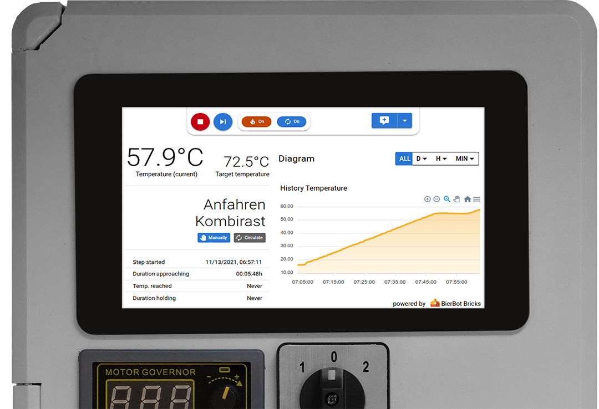
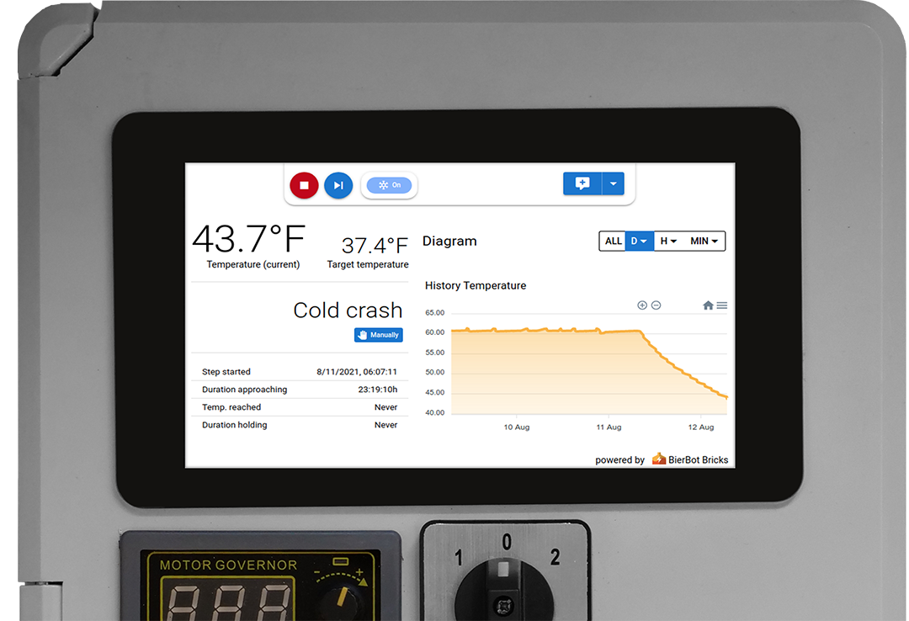

# Raspberry Pi mashing and fermentation controller

This code will turn you Raspberry Pi into a mashing or fermentation controller to automate all parts of your beer brewing process. Setup is super-simple. If you want to showcase your build, please reach out to us [hello@bierbot.com](mailto:hello@bierbot.com). Oh: And please consider giving this repo a ⭐!

There is a extensive step-by-step tutorial how to build one yourself available on the [BierBot.com Blog](https://bierbot.com/blog/howto/howto-build-a-raspberry-pi-based-brewing-control/).

If don't want to do all the electronics/wiring yourself, check out [this alternate WiFi switch firmware](https://github.com/BernhardSchlegel/Brick-32) which runs the same software.

## Key features

- Super easy setup and easy to try out (have a spare SD card?)
- Runs on Raspberry Pi ([compatible Pis](#raspberry-pi-compatibility))
- Various kettle setups supported: BIAB, RIMS, HERMS.
- Free, open source license (GPL-v3)
- PDI controller that works with a simple and cheap non PWM/SSR relay and yet eliminates temperature overshoots.
- Mashing controller and fermentation controller, both with automatic timer control.
- Multi-language (German, English, Portugese, (soon) Finnish, [tell us](https://bierbot.com/contact/) if you want to help!)
- Integrated recipe management: Set the temperature, the time, etc.
- Integrated logging: See your temperature log during the mash and export a PDF after brewing
- User authentication
- Access from everywhere
- Found a brewery and invite friends to share equipment, recipes, etc.
- Works perfectly on any Smartphone, Tablet, PC or Mac (or any web browser)
- Beer.XML import
- Configurable units for temperature (Celsius/Fahrenheit), gravity (°Plato, specific gravity), volume (Liters, Gallons), weight (Grams, pounds) etc.
- Control agitators, pumps, valves.
- Missing something❓  [tell us!](https://github.com/BernhardSchlegel/BierBot-Bricks-RaspberryPi/issues/new) 🗨️

## Screenshots

### Sample Build



### Mashing

:information_source: You can go to this screen manually by clicking on the temperature if a brew is active.



### Fermentation

:information_source: You can go to this screen manually by clicking on the temperature if a brew is active.



## Getting started

### Raspberry Pi OS (Bullseye)

Open a commandline (<kbd>Ctrl</kbd> + <kbd>Alt</kbd> + <kbd>T</kbd>), navigate to your desired folder (e.g. `cd ~/Desktop`) and run the following commands:

```bash
git clone https://github.com/BernhardSchlegel/BierBot-Bricks-RaspberryPi.git
cd BierBot-Bricks-RaspberryPi
sudo pip3 install -r requirements.txt
sudo python3 setup.py
```

Setup will guide you through the installation. :information_source: Hint: You can accept the proposed default value by hitting <kbd>Return</kbd>.

Tested on Python 3.7

## Raspberry Pi compatibility 

The install script and software has been tested on the following
Raspberry Pis ([source](https://de.wikipedia.org/wiki/Raspberry_Pi)):

<table>
   <thead>
      <tr>
         <th>Raspberry Pi</th>
         <th colspan=4>1</th>
         <th colspan=2>2</th>
         <th colspan=3>3</th>
         <th colspan=1>4</th>
      </tr>
         <tr>
            <th>Type</th>
            <th>A</th>
            <th>A+</th>
            <th>B</th>
            <th>B+</th>
            <th>B</th>
            <th>B v1.2</th>
            <th>A+</th>
            <th>B v.1.2</th>
            <th>B+</th>
            <th>B</th>
         </tr>
   </thead>
   <tbody>
      <tr>
         <td>ARM</td>
         <td align="center" colspan=4>ARMv6 (32 Bit)</td>
         <td>ARMv7 (32Bit)</td>
         <td align="center"colspan=5>ARMv8 (64 Bit)</td>
      </tr>
      <tr>
         <td>WiFi onboard</td>
         <td>:x:</td>
         <td>:x:</td>
         <td>:x:</td>
         <td>:x:</td>
         <td>:x:</td>
         <td>:x:</td>
         <td>:heavy_check_mark:</td>
         <td>:heavy_check_mark:</td>
         <td>:heavy_check_mark:</td>
         <td>:heavy_check_mark:</td>
      </tr>
      <tr>
         <td>Bluetooth onboard</td>
         <td>:x:</td>
         <td>:x:</td>
         <td>:x:</td>
         <td>:x:</td>
         <td>:x:</td>
         <td>:x:</td>
         <td>:heavy_check_mark:</td>
         <td>:heavy_check_mark:</td>
         <td>:heavy_check_mark:</td>
         <td>:heavy_check_mark:</td>
      </tr>
      <tr align="center">
         <td>setupscript</td>
         <td></td>
         <td></td>
         <td></td>
         <td></td>
         <td></td>
         <td></td>
         <td></td>
         <td></td>
         <td></td>
         <td>:heavy_check_mark:</td>
      </tr>
      <tr align="center">
         <td>software</td>
         <td></td>
         <td></td>
         <td></td>
         <td></td>
         <td></td>
         <td></td>
         <td></td>
         <td></td>
         <td></td>
         <td>:heavy_check_mark:</td>
      </tr>
   </tbody>
</table>

**TL;DR**: Get the cheapest one! Keep in mind you will need WiFi (so getting an Pi 3 or Pi 4 is probably worth the price). Also, Pi 3 and 4 support bluetooth - which is handy if you want to use it as bridge for you TILT.

If you happen to own one of the models with a blank cell, [shoot us a message](https://bierbot.com/contact/)!

## License

-   The Code: [GPL-3.0](http://opensource.org/licenses/MIT)
-   Orange Mash BierBot Logo: (c) by Bernhard Schlegel, all rights reserved.

Copyright (c) 2021-present, Bernhard Schlegel
